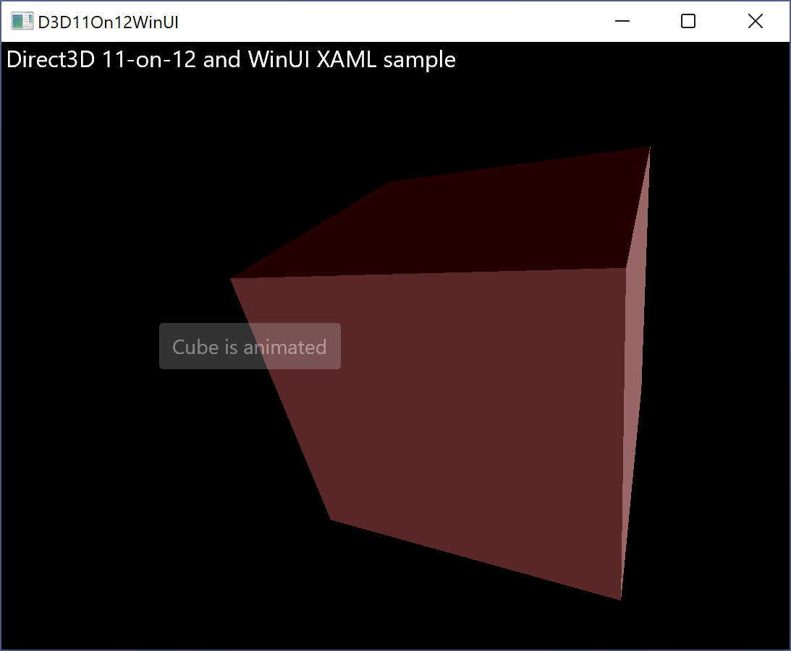

# D3D11On12WinUI

This simple sample shows Direct3D 11-on-12 (and a little [Direct2D](https://docs.microsoft.com/windows/win32/direct2d/direct2d-portal)) interoperating with [Windows UI Library (WinUI)](https://docs.microsoft.com/windows/apps/winui/) XAML (part of the [Windows App SDK](https://docs.microsoft.com/en-us/windows/apps/windows-app-sdk/)).

Writing an app/engine from scratch in [Direct3D 12](https://docs.microsoft.com/windows/win32/direct3d12/direct3d-12-graphics) can be a very daunting undertaking. Especially if you already have a Direct3D 11 engine.

But [Direct3D 11-on-12](https://docs.microsoft.com/windows/win32/direct3d12/direct3d-11-on-12) makes porting apps/engines to Direct3D 12 simpler, because entire Direct3D 11-based components, such as a UI system, can remain virtually untouched.

## Interop with WinUI XAML

Interoperation between a swap chain and a XAML UI is documented in [SwapChainPanel and gaming](https://docs.microsoft.com/windows/uwp/gaming/directx-and-xaml-interop#swapchainpanel-and-gaming).

The main point to note is that, for WinUI XAML, **ISwapChainPanelNative** is defined in `microsoft.ui.xaml.media.dxinterop.h`.
